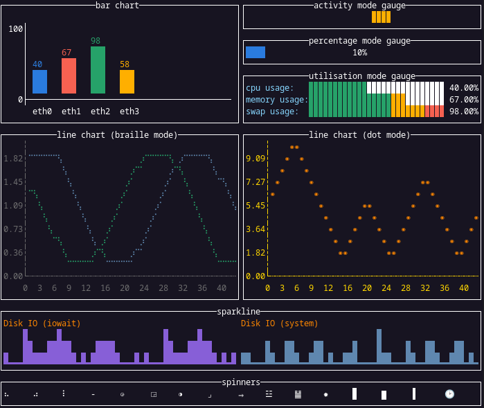

# tvxwidgets


[](https://pkg.go.dev/github.com/malivvan/vv/pkg/cui/chart)

[](https://codecov.io/gh/navidys/tvxwidgets)
[](https://goreportcard.com/report/github.com/malivvan/vv/pkg/cui/chart)

tvxwidgets provides extra widgets for [tview](https://github.com/malivvan/vv/pkg/cui).



## Widgets

* [bar chart](./demos/barchart/)
* [activity mode gauge](./demos/gauge_am/)
* [percentage mode gauge](./demos/gauge_pm/)
* [utilisation mode gauge](./demos/gauge_um/)
* [message dialog (info and error)](./demos/dialog/)
* [spinner](./demos/spinner/)
* [plot (linechart, scatter)](./demos/plot/)
* [sparkline](./demos/sparkline/)


## Example

```go
package main

import (
	"time"

	"github.com/gdamore/tcell/v2"
	"github.com/malivvan/vv/pkg/cui/chart"
	"github.com/malivvan/vv/pkg/cui"
)

func main() {
	app := cui.NewApplication()
	gauge := tvxwidgets.NewActivityModeGauge()
	gauge.SetTitle("activity mode gauge")
	gauge.SetPgBgColor(tcell.ColorOrange)
	gauge.SetRect(10, 4, 50, 3)
	gauge.SetBorder(true)

	update := func() {
		tick := time.NewTicker(500 * time.Millisecond)
		for {
			select {
			case <-tick.C:
				gauge.Pulse()
				app.Draw()
			}
		}
	}
	go update()

	if err := app.SetRoot(gauge, false).EnableMouse(true).Run(); err != nil {
		panic(err)
	}
}

```
